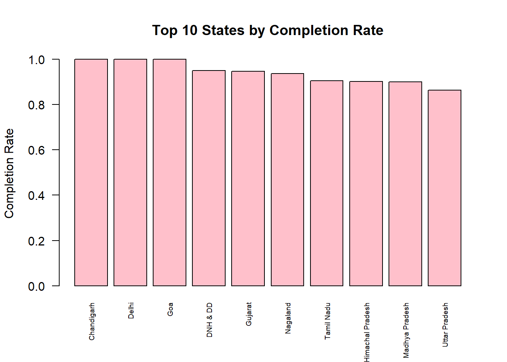

# 🏠 PMAY Housing Analysis (Capstone Project)

## 📊 Overview
This project presents a statistical analysis of the **Pradhan Mantri Awas Yojana (PMAY)** scheme, focusing on evaluating implementation performance across different states.

The analysis identifies patterns, inefficiencies, and performance differences using data normalization and visualization techniques.

---

## 📸 Sample Visualization

---

## 🎯 Objectives
- Evaluate state-wise housing scheme performance  
- Identify implementation gaps and inefficiencies  
- Compare performance across regions in a fair and scale-independent manner  

---

## 🧠 Approach 
The project follows a structured analytical workflow:

- Data cleaning and preprocessing  
- Removal of aggregated bias (e.g., total rows)  
- Creation of normalized performance indicators  
- Exploratory Data Analysis (EDA)  
- Visualization-based insight generation  

**Detailed implementation is not included in this repository. 
This project focuses on showcasing analytical thinking and insights.**

---

## 📈 Key Analytical Focus
- Performance variation across states  
- Efficiency of resource utilization  
- Identification of outliers and anomalies  
- Relationship between allocation and outcomes  

---

## 📊 Sample Visualizations
- Bar chart for comparative performance  
- Boxplot for outlier detection  
- Scatter plot for relationship analysis  

---
## 📁 Repository Structure

pmay-housing-analysis/
│
├── README.md
├── outputs/
│ ├── completion_rate_barplot.png
│ ├── outlier_detection_boxplot.png
│ └── scatterplot.png
│
├── docs/
│ └── methodology.txt

---

## ⚠️ Important Note
This repository contains a **limited version** of the project.

---

## 🔮 Future Enhancements
- Migration to Python-based analysis  
- Integration of machine learning models  
- Development of an interactive dashboard  
- Inclusion of additional features for deeper insights  

---

## 👨‍💻 Author
**Sibgha**  
